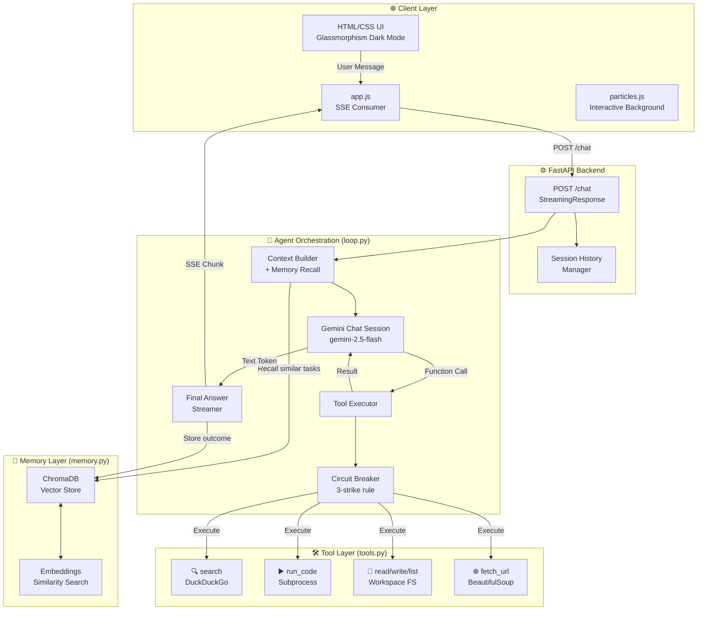
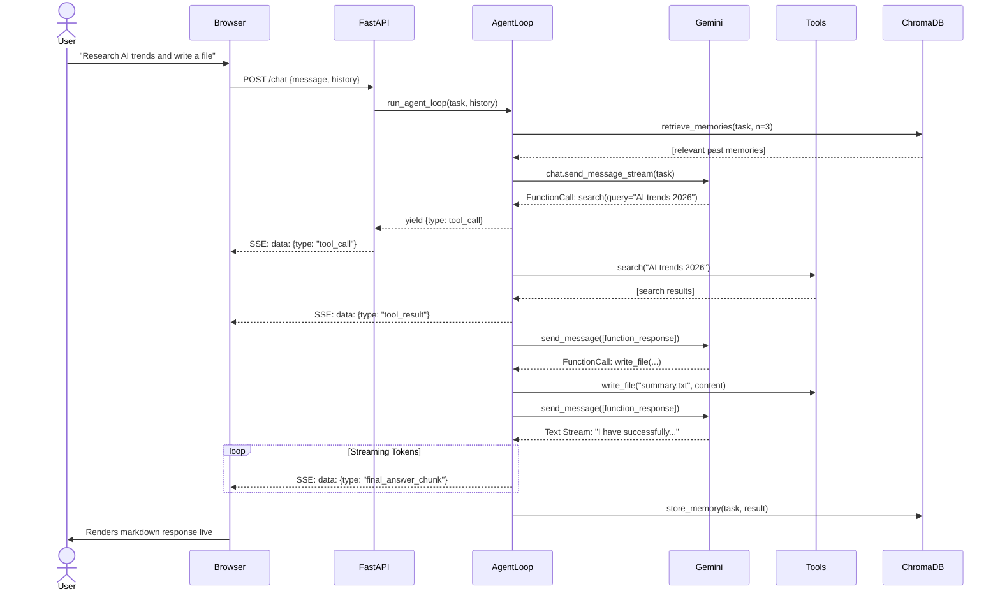
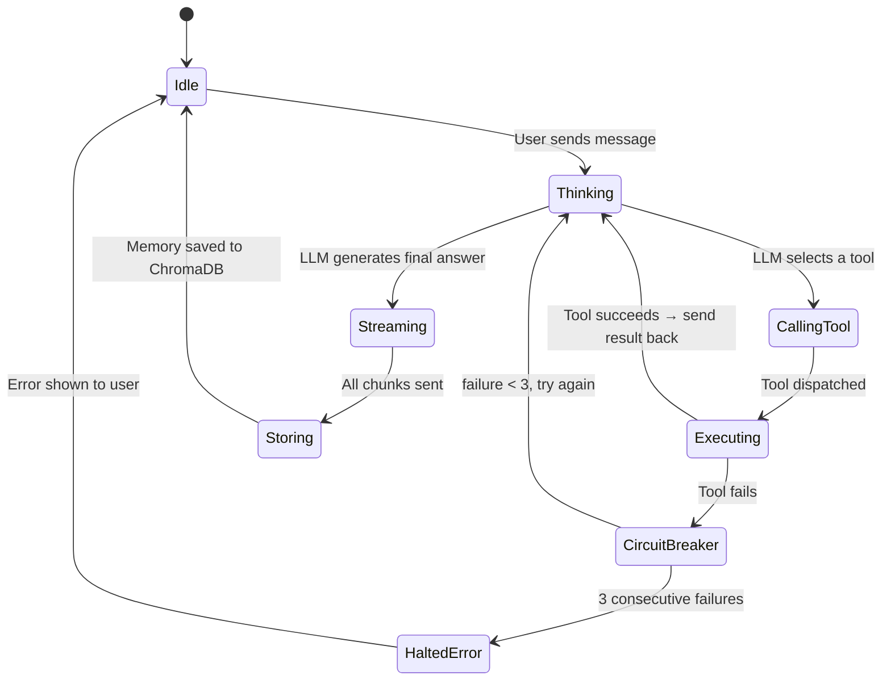
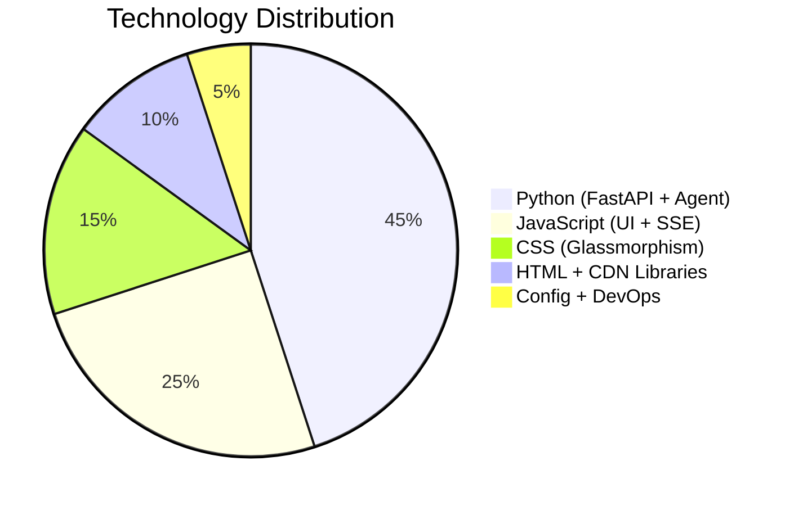

<div align="center">

<!-- Capsule Render Banner -->


<!-- Typing Animation -->
<a href="https://github.com/AyushGU12/AgentForge">
  
</a>

<br/>

<!-- Core Badges -->
[](https://github.com/AyushGU12/AgentForge/stargazers)
[](https://github.com/AyushGU12/AgentForge/network)
[](https://github.com/AyushGU12/AgentForge/issues)
[](LICENSE)
[](https://github.com/AyushGU12/AgentForge/commits)

<br/>

<!-- Visitor Counter -->


</div>

---

## 🧠 What is AgentForge?

<table>
<tr>
<td width="60%">

AgentForge is a **production-grade, custom AI Agent framework** built from first principles — not layered on top of LangChain or AutoGPT. It implements a complete **Observe → Think → Act → Remember** loop powered by **Google Gemini 2.5 Flash**, with real tool execution, long-term vector memory, and robust failure recovery.

The core thesis: **understanding the agent loop at the implementation level**, not just calling a framework. AgentForge is the project that gets you past the resume screen for AI engineering roles in 2026.

> *"The gap between candidates who've used an LLM and those who understand agent loops, tool-calling protocols, and failure recovery is exactly the gap that matters."*

</td>
<td width="40%">

```
╔══════════════════════════════╗
║     AGENT LOOP OVERVIEW      ║
║                              ║
║  📥 User Task                ║
║       ↓                      ║
║  🧠 LLM Reasoning            ║
║       ↓                      ║
║  🛠  Tool Selection           ║
║       ↓                      ║
║  ⚡ Tool Execution            ║
║       ↓                      ║
║  🔁 Re-evaluate Result       ║
║       ↓                      ║
║  💾 Store in Memory          ║
║       ↓                      ║
║  📤 Stream Final Answer      ║
╚══════════════════════════════╝
```

</td>
</tr>
</table>

---

## ⚡ Key Highlights

<div align="center">

|  |  |  |  |
|:---:|:---:|:---:|:---:|
| 🤖 **Custom Agent Loop** | 🛠️ **6 Real Tools** | 💾 **ChromaDB Memory** | ⚡ **SSE Streaming** |
| Built from scratch, no LangChain | Search, Code, File I/O, Scrape | Persistent vector-similarity recall | Real-time token-by-token output |
| 🔒 **Circuit Breaker** | 🕰️ **Session History** | 🌊 **Particle UI** | 🐍 **Python 3.13** |
| Stops infinite failure loops | Multi-turn context aware | Interactive animated frontend | Fully async FastAPI backend |

</div>

---

## 🏗️ System Architecture

### High-Level Overview

```
┌─────────────────────────────────────────────────────────────────────┐
│                         CLIENT (Browser)                            │
│                                                                     │
│  ┌─────────────┐   SSE Stream   ┌──────────────────────────────┐   │
│  │   UI Layer  │◄───────────────│  static/app.js (Vanilla JS)  │   │
│  │ HTML/CSS/JS │   Fetch POST   │  marked.js + highlight.js    │   │
│  │ particles.js│───────────────►│  particles.js + Lucide icons │   │
│  └─────────────┘                └──────────────────────────────┘   │
└──────────────────────────────┬──────────────────────────────────────┘
                               │ HTTP/SSE
┌──────────────────────────────▼──────────────────────────────────────┐
│                       FASTAPI BACKEND                               │
│                                                                     │
│  ┌────────────────┐   ┌─────────────────┐   ┌──────────────────┐  │
│  │ POST /chat     │   │ StreamingResponse│   │  History Manager │  │
│  │ Request Parser │──►│ SSE Event Loop  │──►│  (session scope) │  │
│  └────────────────┘   └────────┬────────┘   └──────────────────┘  │
└───────────────────────────────-┼────────────────────────────────────┘
                                 │
┌────────────────────────────────▼────────────────────────────────────┐
│                      AGENT ORCHESTRATION LAYER                      │
│                                                                     │
│  ┌─────────────────────────────────────────────────────────────┐   │
│  │                     agent/loop.py                           │   │
│  │                                                             │   │
│  │  ┌──────────┐  ┌──────────┐  ┌───────────┐  ┌──────────┐  │   │
│  │  │ Context  │  │  Gemini  │  │  Tool     │  │ Circuit  │  │   │
│  │  │ Builder  │─►│  Chat    │─►│ Executor  │─►│ Breaker  │  │   │
│  │  │ (memory) │  │ Session  │  │           │  │ (3-fail) │  │   │
│  │  └──────────┘  └──────────┘  └───────────┘  └──────────┘  │   │
│  └─────────────────────────────────────────────────────────────┘   │
└───────────────────────────────┬────────────────────────────────────-┘
                                │
          ┌─────────────────────┼─────────────────────┐
          │                     │                     │
┌─────────▼────────┐  ┌─────────▼────────┐  ┌────────▼─────────┐
│   TOOL LAYER     │  │   GEMINI API     │  │  MEMORY LAYER    │
│ agent/tools.py   │  │ gemini-2.5-flash │  │ agent/memory.py  │
│                  │  │                  │  │                  │
│  🔍 search       │  │  Function        │  │  ChromaDB        │
│  ▶  run_code     │  │  Calling API     │  │  Vector Store    │
│  📖 read_file    │  │                  │  │                  │
│  ✏️  write_file   │  │  Streaming       │  │  Embedding       │
│  📁 list_dir     │  │  Response        │  │  Similarity      │
│  🌐 fetch_url    │  │                  │  │  Search          │
└──────────────────┘  └──────────────────┘  └──────────────────┘
```

---

### Mermaid Architecture Diagrams

<details>
<summary>📊 Click to expand: Full Architecture Graph</summary>



</details>

<details>
<summary>🔄 Click to expand: Request Flow Sequence Diagram</summary>



</details>

<details>
<summary>📦 Click to expand: State Machine Diagram</summary>



</details>

<details>
<summary>🗓️ Click to expand: Project Roadmap Gantt Chart</summary>

```mermaid
gantt
    title AgentForge Development Roadmap
    dateFormat  YYYY-MM-DD
    section Core Engine
    Custom Agent Loop           :done,    loop,  2026-06-01, 2026-06-10
    Tool Definitions (6 tools)  :done,    tools, 2026-06-05, 2026-06-15
    ChromaDB Long-Term Memory   :done,    mem,   2026-06-10, 2026-06-18
    Circuit Breaker & Recovery  :done,    cb,    2026-06-15, 2026-06-20
    section API & Streaming
    FastAPI Backend             :done,    api,   2026-06-18, 2026-06-22
    SSE Streaming               :done,    sse,   2026-06-20, 2026-06-25
    Session History             :done,    hist,  2026-06-22, 2026-06-26
    section UI
    Premium Dark Mode UI        :done,    ui1,   2026-06-23, 2026-06-25
    Markdown + Syntax Highlight :done,    md,    2026-06-24, 2026-06-26
    3D Logo + Particle Network  :done,    ui2,   2026-06-25, 2026-06-26
    section Future
    Docker + Compose            :active,  docker,2026-06-27, 2026-07-02
    Multi-Agent Orchestration   :planned, multi, 2026-07-05, 2026-07-20
    Agent Marketplace           :planned, mkt,   2026-07-20, 2026-08-10
```

</details>

<details>
<summary>🥧 Click to expand: Tech Stack Distribution</summary>



</details>

---

## 🛠️ Tech Stack

<div align="center">

[](https://python.org)
[](https://fastapi.tiangolo.com)
[](https://developer.mozilla.org/en-US/docs/Web/JavaScript)
[](https://developer.mozilla.org/en-US/docs/Web/HTML)
[](https://developer.mozilla.org/en-US/docs/Web/CSS)
[](https://git-scm.com)
[](https://github.com)
[](https://code.visualstudio.com)

</div>

<br/>

| Layer | Technology | Purpose |
|-------|-----------|---------|
| **LLM** | Google Gemini 2.5 Flash | Reasoning, tool selection, streaming |
| **Agent Framework** | Custom Python Generator | Orchestration loop — no LangChain |
| **Backend** | FastAPI + Uvicorn | Async API, SSE streaming |
| **Memory** | ChromaDB | Long-term vector similarity store |
| **Web Search** | DuckDuckGo Search (`duckduckgo-search`) | Free, no API key required |
| **Code Execution** | Python `subprocess` | Sandboxed code runner |
| **Web Scraping** | `requests` + `BeautifulSoup4` | Full-text URL extraction |
| **Frontend** | Vanilla HTML/CSS/JS | No framework overhead |
| **Markdown** | `marked.js` | Live markdown rendering in chat |
| **Syntax Highlighting** | `highlight.js` (Atom One Dark) | Code block beautification |
| **Icons** | Lucide Icons | Professional vector icon set |
| **Particles** | `particles.js` | Interactive neural network background |
| **Fonts** | Google Fonts (Outfit + Inter) | Premium typography |

---

## 📁 Project Structure

```
📦 AgentForge
 ┣ 📂 agent/                    # Core agent logic package
 ┃ ┣ 📜 __init__.py
 ┃ ┣ 📜 loop.py                 # ⭐ Custom agent orchestration loop
 ┃ ┣ 📜 tools.py                # 🛠️  All tool implementations (6 tools)
 ┃ ┗ 📜 memory.py               # 💾 ChromaDB long-term memory
 ┣ 📂 static/                   # Frontend assets (served by FastAPI)
 ┃ ┣ 📜 index.html              # App shell
 ┃ ┣ 📜 style.css               # Glassmorphism dark-mode styles
 ┃ ┣ 📜 app.js                  # SSE consumer, UI logic
 ┃ ┗ 🖼️  logo.png               # 3D AI core logo
 ┣ 📂 memory_db/                # ChromaDB persistence (auto-generated)
 ┣ 📂 workspace/                # Agent file sandbox (auto-generated)
 ┣ 📜 main.py                   # FastAPI app entry point
 ┣ 📜 requirements.txt          # Python dependencies
 ┣ 📜 .env                      # Environment variables (not committed)
 ┣ 📜 .gitignore
 ┗ 📜 README.md
```

---

## ✨ Features

### 🤖 Agent Core
| Status | Feature |
|--------|---------|
| ✅ | Custom agent loop (no LangChain dependency) |
| ✅ | Google Gemini 2.5 Flash with function calling |
| ✅ | Parallel tool calling support |
| ✅ | Circuit breaker (stops after 3 consecutive tool failures) |
| ✅ | Session-scoped short-term memory |
| ✅ | Long-term memory via ChromaDB vector similarity |

### 🛠️ Tools
| Status | Tool | Description |
|--------|------|-------------|
| ✅ | `search` | DuckDuckGo web search |
| ✅ | `run_code` | Execute Python in a subprocess sandbox |
| ✅ | `read_file` | Read file from workspace |
| ✅ | `write_file` | Write file to workspace |
| ✅ | `list_dir` | List workspace directory contents |
| ✅ | `fetch_url` | Scrape full text from any URL |
| 🔄 | `send_email` | Send emails via SMTP |
| 📌 | `browse_web` | Full browser automation (Playwright) |
| 📌 | `image_gen` | Generate images via Imagen API |

### 🎨 UI & Frontend
| Status | Feature |
|--------|---------|
| ✅ | Premium glassmorphism dark mode |
| ✅ | Interactive particle network background |
| ✅ | 3D AI-generated logo |
| ✅ | Real-time SSE token streaming |
| ✅ | Live markdown rendering with syntax highlighting |
| ✅ | Collapsible tool call accordions |
| ✅ | Animated typing indicator |
| ✅ | New Chat session reset |
| 📌 | Mobile responsive layout |
| 📌 | Dark/Light theme toggle |

### ⚙️ Backend
| Status | Feature |
|--------|---------|
| ✅ | FastAPI + Uvicorn async backend |
| ✅ | Server-Sent Events (SSE) streaming |
| ✅ | Multi-turn conversation history |
| 🔄 | Docker containerization |
| 📌 | Rate limiting |
| 📌 | API key authentication |

---

## 🚀 Quick Start

### Prerequisites

```bash
- Python 3.11+
- A Google Gemini API Key (get one free at aistudio.google.com)
- Git
```

### 1. Clone the Repository

```bash
git clone https://github.com/AyushGU12/AgentForge.git
cd AgentForge
```

### 2. Create Virtual Environment

```bash
python -m venv venv

# Windows
venv\Scripts\activate

# macOS / Linux
source venv/bin/activate
```

### 3. Install Dependencies

```bash
pip install -r requirements.txt
```

### 4. Set Environment Variables

Create a `.env` file in the root directory:

```env
# .env
GEMINI_API_KEY=your_gemini_api_key_here
```

> 💡 Get a free API key at [aistudio.google.com](https://aistudio.google.com)

### 5. Run the Server

```bash
python main.py
```

Open your browser at **http://127.0.0.1:8000** 🎉

---

## 🐳 Docker Setup

<details>
<summary>Click to expand Docker instructions</summary>

### Dockerfile

```dockerfile
FROM python:3.11-slim

WORKDIR /app

COPY requirements.txt .
RUN pip install --no-cache-dir -r requirements.txt

COPY . .

EXPOSE 8000

CMD ["python", "main.py"]
```

### docker-compose.yml

```yaml
version: '3.8'

services:
  agentforge:
    build: .
    ports:
      - "8000:8000"
    environment:
      - GEMINI_API_KEY=${GEMINI_API_KEY}
    volumes:
      - ./workspace:/app/workspace
      - ./memory_db:/app/memory_db
    restart: unless-stopped
```

### Build & Run

```bash
# Build the image
docker build -t agentforge .

# Run with Docker Compose
docker-compose up -d

# View logs
docker-compose logs -f
```

</details>

---

## 🔌 API Reference

### `POST /chat`

Submit a task to the AI agent and receive a real-time SSE stream.

**Request Body**

```json
{
  "message": "Search for Python async best practices and write a summary file",
  "history": [
    { "role": "user-message", "content": "Previous user message" },
    { "role": "agent-message", "content": "Previous agent response" }
  ]
}
```

**SSE Event Types**

| Event Type | Payload | Description |
|-----------|---------|-------------|
| `status` | `{ "content": "Starting agent loop..." }` | Status update message |
| `tool_call` | `{ "tool": "search", "args": { "query": "..." } }` | Agent is about to run a tool |
| `tool_result` | `{ "tool": "search", "result": "..." }` | Tool execution result |
| `final_answer_chunk` | `{ "content": "token..." }` | Streamed text token |
| `final_answer` | `{ "content": "" }` | Stream completion signal |
| `error` | `{ "content": "Error message" }` | Error occurred |

**cURL Example**

```bash
curl -X POST http://localhost:8000/chat \
  -H "Content-Type: application/json" \
  -d '{"message": "Search for latest AI news", "history": []}' \
  --no-buffer
```

---

## 🔒 Security Considerations

| Area | Implementation |
|------|---------------|
| **API Key** | Stored in `.env`, never committed to VCS |
| **Code Execution** | Sandboxed to subprocess; blocked from accessing system paths |
| **File I/O** | All operations scoped to `workspace/` directory only |
| **CORS** | Configured via FastAPI `CORSMiddleware` |
| **Input Validation** | Pydantic models validate all incoming request bodies |
| **`.gitignore`** | `.env`, `__pycache__`, `memory_db/`, `workspace/` excluded |

> ⚠️ **Note**: The code execution sandbox is functional but not hardened for multi-user production deployment. For a public deployment, consider using Docker-in-Docker or a service like `e2b.dev` for true code sandboxing.

---

## 📈 Performance & Scalability

<details>
<summary>Click to expand Performance Notes</summary>

### Current Performance Profile
- **TTFB (Time to First Byte)**: ~400ms (Gemini API cold start)
- **Tool Execution Overhead**: ~200-2000ms depending on tool
- **Memory Retrieval**: <50ms (local ChromaDB)
- **Streaming Latency**: ~10ms per token after first byte

### Scaling Considerations

| Concern | Current State | Production Solution |
|---------|--------------|---------------------|
| **Concurrency** | Single-threaded loop | Move agent loop to background workers (Celery/Redis) |
| **Memory DB** | Local ChromaDB | Chroma Cloud or Pinecone for multi-instance |
| **Sessions** | In-memory | Redis session store |
| **LLM Cost** | Gemini 2.5 Flash (cheap) | Rate limiting + per-user quotas |
| **Horizontal Scaling** | Single instance | Stateless FastAPI behind NGINX load balancer |

</details>

---

## 🧪 Testing

```bash
# Install test dependencies
pip install pytest pytest-asyncio httpx

# Run all tests
pytest tests/ -v

# Run with coverage
pytest tests/ --cov=agent --cov-report=html
```

<details>
<summary>Example: Unit Test for Circuit Breaker</summary>

```python
# tests/test_circuit_breaker.py
import pytest
from agent.tools import AVAILABLE_TOOLS

def test_circuit_breaker_triggers_after_3_failures():
    """Ensure the agent halts after 3 consecutive tool failures."""
    from agent.loop import run_agent_loop
    events = list(run_agent_loop("call_a_broken_tool", max_iterations=10))
    error_events = [e for e in events if e["type"] == "error"]
    assert any("Circuit Breaker" in e["content"] for e in error_events)
```

</details>

---

## ⚙️ CI/CD Pipeline

<details>
<summary>Click to expand GitHub Actions Workflow</summary>

```yaml
# .github/workflows/ci.yml
name: AgentForge CI

on:
  push:
    branches: [ main, develop ]
  pull_request:
    branches: [ main ]

jobs:
  lint-and-test:
    runs-on: ubuntu-latest
    steps:
      - uses: actions/checkout@v4

      - name: Set up Python 3.11
        uses: actions/setup-python@v4
        with:
          python-version: '3.11'

      - name: Install dependencies
        run: |
          pip install -r requirements.txt
          pip install pytest ruff

      - name: Lint with ruff
        run: ruff check .

      - name: Run tests
        env:
          GEMINI_API_KEY: ${{ secrets.GEMINI_API_KEY }}
        run: pytest tests/ -v

  docker-build:
    runs-on: ubuntu-latest
    needs: lint-and-test
    steps:
      - uses: actions/checkout@v4
      - name: Build Docker Image
        run: docker build -t agentforge:${{ github.sha }} .
```

</details>

---

## 📊 Monitoring & Observability

| Signal | Tool | Notes |
|--------|------|-------|
| **Application Logs** | Python `logging` + Uvicorn | Structured JSON logs |
| **Error Tracking** | Sentry (recommended) | Add `sentry-sdk[fastapi]` |
| **API Metrics** | Prometheus + Grafana | `/metrics` endpoint |
| **Uptime** | UptimeRobot (free) | External HTTP monitoring |
| **LLM Costs** | Google AI Studio Dashboard | Monitor token usage |

---

## 🗺️ Roadmap

- [x] Custom agent loop with Gemini function calling
- [x] 6 real tools (search, code, files, scrape)
- [x] ChromaDB long-term memory
- [x] Circuit breaker failure recovery
- [x] Real-time SSE streaming
- [x] Premium particle UI with 3D logo
- [x] Markdown + syntax highlighting
- [x] Session history (multi-turn)
- [ ] Docker containerization
- [ ] Rate limiting & API authentication
- [ ] Multi-agent orchestration (agent-to-agent communication)
- [ ] Agent marketplace (plug-in custom tools)
- [ ] Browser automation tool (Playwright)
- [ ] Voice input/output interface

---

## 🤝 Contributing

Contributions, issues and feature requests are welcome! Feel free to check the [issues page](https://github.com/AyushGU12/AgentForge/issues).

<details>
<summary>Click to expand Contributing Guide</summary>

### Branch Strategy

```
main           ← stable, production-ready
develop        ← integration branch
feat/<name>    ← new features
fix/<name>     ← bug fixes
chore/<name>   ← non-functional changes
```

### Commit Convention

| Emoji | Prefix | When to use |
|-------|--------|-------------|
| ✨ | `feat:` | New feature |
| 🐛 | `fix:` | Bug fix |
| 🔥 | `chore:` | Remove code/files |
| 📝 | `docs:` | Documentation |
| 💄 | `style:` | UI / formatting |
| ♻️ | `refactor:` | Code refactoring |
| 🚀 | `perf:` | Performance improvement |
| ✅ | `test:` | Adding tests |
| 🔒 | `security:` | Security fix |

### PR Process

1. Fork the repo and create your branch from `develop`
2. Ensure your code passes `ruff check .`
3. Write or update tests for your changes
4. Open a Pull Request with a clear title and description

</details>

---

## 📜 License

Distributed under the **MIT License**. See [`LICENSE`](LICENSE) for more information.

---

## 👤 Author

<div align="center">

**Ayush** · [@AyushGU12](https://github.com/AyushGU12)

[](https://github.com/AyushGU12)

</div>

---

<div align="center">

<!-- Animated footer wave -->


<br/>

**If AgentForge helped you land a role or learn something new, please consider giving it a ⭐**

<br/>

Made with ❤️ by **AyushGU12** &nbsp;·&nbsp; Powered by **Google Gemini**

</div>


## Deployment
- Cloud Run CI/CD configured in `.github/workflows/deploy-cloudrun.yml`.
- Run `gcloud run deploy` to deploy the backend.

## 🚀 Cloud Deployment Architecture

This project is fully optimized for cloud deployment with 100% parity to the local development environment. It supports a dual-architecture deployment model:

### 1. Platform Native (PaaS)
Pre-configured for zero-downtime deployment on platforms like Render, Vercel, or Firebase.
- Native configuration files (e.g., 
ender.yaml) are included for one-click deployments.
- Environment variables prioritize cloud APIs (Groq, Gemini, OpenAI) to ensure compatibility with free-tier memory limits.

### 2. Dockerized Containers
For isolated, infrastructure-agnostic deployment on VPS or Cloud Run.
- **Multi-stage Dockerfile**: Optimized for lightweight, fast builds.
- **docker-compose.yml**: Configured with strict health checks, network isolation, and unless-stopped restart policies.
- Automatically handles local dependencies and avoids local OOM crashes by prioritizing cloud inference APIs.

### 🔄 CI/CD Pipeline
Continuous Integration and Deployment is handled via GitHub Actions.
- Workflows are configured in .github/workflows/ to automatically test and deploy changes pushed to the main branch.
